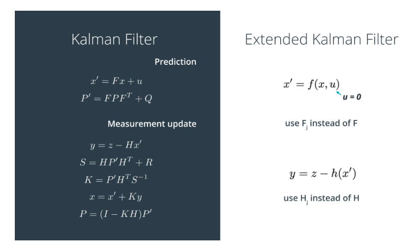
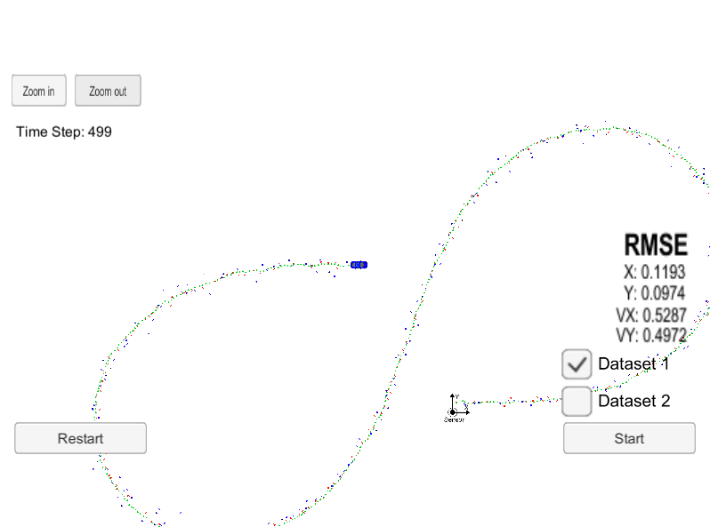

# Extended Kalman Filter Project

This project implements extened Kalman filter algorithm based on lidar
and radar sensor data.

## Algorithm

The EKF algorithm consists of prediction and measurement update steps.
The intuition is predicting object's state based on previous estimation
and then correcting our prediction based on sensor measurement.

For lidar measurement, Hx function is linear. So we can apply the Kalman
filter algorithm directly. For radar measurement, hx is non linear. Thus,
we need to map our state to polar coordinates and derive Tyler Expansion for Hx.

  
   
  <em>Figure 1: EKF Algorithm</em>

## Result

The final tracking result and RMSE is showed in Figure 2.

  
   
  <em>Figure 2: Final Result</em>

## Reference
- [Sensor Fusion and Object Tracking using an Extended Kalman Filter Algorithm — Part 1,](https://medium.com/@mithi/object-tracking-and-fusing-sensor-measurements-using-the-extended-kalman-filter-algorithm-part-1-f2158ef1e4f0)
- [Estimation of Sideslip Angle Based on Extended Kalman Filter,](https://www.hindawi.com/journals/jece/2017/5301602/)
- [Udacity Self-Driving Car Nanodegree Project 6 - Extended Kalman Filter,](http://jeremyshannon.com/2017/04/21/udacity-sdcnd-extended-kalman-filter.html)
- [Extended Kalman Filter for Channel Estimation in Rayleigh Fading Environment and Fadingless Environment.](https://www.ijser.org/paper/Extended-Kalman-Filter-for-Channel-Estimation-in-Rayleigh-Fading-Environment-and-Fadingless-Environment.html)
